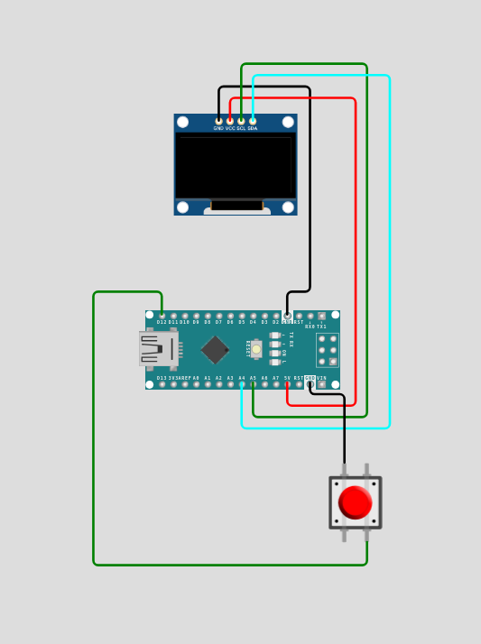

# Flappy Bird Game 

<p align="center">
  
</p>

---

## Project Overview

A complete Flappy Bird clone implementation for Arduino microcontrollers using the U8g2 graphics library and SH1106 OLED display (128x64 pixels).

---

## Installation

### Prerequisites
- **Arduino IDE 1.8.x or higher** ([Download here](https://www.arduino.cc/en/software))
- USB cable (USB-A to USB-B for Uno, or appropriate for your board)
- Git (optional, for cloning method)

---

### Method 1: Download from GitHub Release (Easiest)

**Perfect for beginners who just want to use the game**

#### Step 1: Download the Code
1. Visit the [Releases page](https://github.com/aydakikio/flappy_bird_arduino/releases)
2. Click on the latest release
3. Download the **flappy_bird_arduino.ino** file

#### Step 2: Install U8g2 Library
1. Open **Arduino IDE**
2. Go to **Sketch → Include Library → Manage Libraries...**
3. In the search box, type: `U8g2`
4. Find **U8g2 by olikraus**
5. Click **Install**
6. Wait for "Installed" confirmation

#### Step 3: Open the Project
1. In Arduino IDE, go to **File → Open**
2. Navigate to the project folder
3. Select `flappy_bird.ino`
4. The code will open in the IDE

#### Step 4: Configure Arduino
1. Connect your Arduino to computer via USB
2. Select Board: **Tools → Board → Arduino AVR Boards → Arduino Uno**
3. Select Port: **Tools → Port → COM3** (Windows) or **/dev/ttyUSB0** (Linux) or **/dev/cu.usbserial** (Mac)
   - The port with "(Arduino Uno)" next to it

#### Step 5: Upload
1. Click the **Upload** button (→ icon) or press `Ctrl+U`
2. Wait for compilation to complete
3. Look for "Done uploading" message at the bottom
4. The game should start immediately!

---

### Method 2: Clone from GitHub

**Perfect for developers who want to modify or contribute**

#### Step 1: Clone the Repository
Open terminal/command prompt and run:

```bash
# Clone using HTTPS
git clone https://github.com/aydakikio/flappy_bird_arduino.git

# Navigate into project folder
cd flappy_bird_arduino
```

#### Step 2: Install U8g2 Library
1. Open **Arduino IDE**
2. **Sketch → Include Library → Manage Libraries...**
3. Search for `U8g2`
4. Install **U8g2 by olikraus**

#### Step 3: Open the Project
```bash
# Option A: Open from terminal (if arduino-cli installed)
arduino source_code/flappy_bird.ino

# Option B: Open Arduino IDE manually
# File → Open → Navigate to cloned folder→ source_code folder → flappy_bird.ino
```

#### Step 4: Configure and Upload
1. **Tools → Board → Arduino AVR Boards → Arduino Uno**
2. **Tools → Port** → Select your Arduino port
3. Click **Upload** (→) or press `Ctrl+U`

---

### Verify Installation

After successful upload, you should see:

✅ **Display powers on** - OLED screen lights up  
✅ **Game border appears** - Rectangle frame around play area  
✅ **Score shows "Score: 0"** - At top of screen  
✅ **Bird is visible** - Small sprite at left side  
✅ **Pipes scroll** - Moving from right to left  
✅ **Button works** - Pressing button makes bird jump  

**If anything doesn't work**, check the [Troubleshooting](#troubleshooting) section below.

---
## Hardware Requirements

### Components
- **Microcontroller**: Arduino Uno/Nano or compatible
- **Display**: SH1106 128x64 OLED (I2C interface)
- **Input**: Push button (pull-up configuration)
- **Connections**:
  - I2C SDA → A4
  - I2C SCL → A5
  - Button → Pin 12 (INPUT_PULLUP)

### Wiring Diagram
<p align="center">
  
</p>

---

## Software Architecture

### System Design Pattern
The codebase follows a **Game Loop Architecture** with clear separation of concerns:

```
┌─────────────────────────────────────┐
│         Main Game Loop              │
│  ┌───────────────────────────────┐  │
│  │  1. Input Handling            │  │
│  │  2. State Update              │  │
│  │  3. Collision Detection       │  │
│  │  4. Rendering                 │  │
│  └───────────────────────────────┘  │
└─────────────────────────────────────┘
```

### Core Components

#### 1. **State Management**
- Game operates in two states: `PLAYING` and `GAME_OVER`
- State transitions handled via `game_over` boolean flag
- Score and difficulty tracked globally

#### 2. **Physics Engine**
```cpp
Velocity Update:  V(t+1) = V(t) + gravity
Position Update:  Y(t+1) = Y(t) + V(t+1)
Jump Impulse:     V = jumpStrength (negative)
```

#### 3. **Rendering Pipeline**
Uses U8g2's page buffer system:
- `firstPage()` - Initialize drawing
- `do {...} while(nextPage())` - Double buffering
- Eliminates screen flicker

---

## Code Structure

### File Organisation

```
├── Hardware Configuration
│   ├── Display driver initialisation
│   └── Pin definitions
│
├── Game Constants
│   ├── Display dimensions
│   ├── Physics parameters
│   └── Game object sizes
│
├── Data Structures
│   ├── Bird (position, velocity, jump)
│   └── Pipe (position, gap, state)
│
├── Game Logic
│   ├── Initialise/Restart
│   ├── Input Handling
│   ├── Physics Update
│   ├── Collision Detection
│   ├── Scoring System
│   └── Difficulty Scaling
│
└── Rendering
    ├── Game Scene
    └── Game Over Screen
```

---

## Key Functions Documentation

### Core Game Loop

#### `loop()`
**Purpose**: Main execution loop  
**Frequency**: ~33 FPS (30ms delay)  
**Flow**:
```
if (game_active):
    process_input()
    update_physics()
    detect_collisions()
    render_frame()
else:
    show_game_over()
    wait_for_restart()
```

---

### Initialization

#### `initialize_game()`
**Purpose**: Reset all game objects to the starting state  
**Called**: On startup and restart  
**Operations**:
- Bird position: (30, 32)
- Bird velocity: 0
- Pipes: 3 instances with random gaps
- Pipe spacing: 65px ± 10px variation

---

### Physics System

#### `Update_Bird()`
**Purpose**: Apply gravity and update bird position  
**Physics Model**:
```
Gravity Constant:     1 pixel/frame²
Terminal Velocity:    2 pixels/frame
Jump Strength:        -3 pixels/frame
```

**Boundary Conditions**:
- Top boundary: Y = 14 (GAME_AREA_TOP + BIRD_SIZE)
- Bottom boundary: Y = 58 (SCREEN_HEIGHT - BIRD_SIZE)
- Collision with boundary → Game Over

---

### Collision Detection

#### `check_collision()`
**Algorithm**: Axis-Aligned Bounding Box (AABB)

**Bird Hitbox**:
```
Left:   bird.x - 7
Right:  bird.x + 7
Top:    bird.y - 6
Bottom: bird.y + 6
```

**Collision Logic**:
1. Check horizontal overlap with each pipe
2. If overlapping:
   - Check if the bird is above the top pipe
   - Check if the bird is below the bottom pipe
3. Return `true` on any collision

**Time Complexity**: O(n) where n = NUM_PIPES

---

### Pipe Management

#### `update_Pipes()`
**Purpose**: Move pipes and recycle off-screen pipes

**Recycling Algorithm**:
```python
for each pipe:
    move left by pipeSpeed
    
    if pipe off-screen:
        Find the rightmost pipe position
        place new pipe with random spacing (35-55px)
        randomise gap position (22-50px)
        reset passed flag
```

**Design Pattern**: Object Pool Pattern (reuses 3 pipe objects)

---

### Scoring System

#### `Update_Score()`
**Trigger**: Bird's X position passes pipe's right edge  
**Implementation**:
```cpp
if (!pipe.passed && pipe.right < bird.x):
    pipe.passed = true
    score++
```

**State Management**: `passed` flag prevents double-counting

---

### Difficulty Progression

#### `Update_Difficulty()`
**Strategy**: Speed scaling based on score thresholds

| Score Range | Pipe Speed | Difficulty |
|-------------|------------|------------|
| 0-9         | 1 px/frame | Easy       |
| 10-19       | 2 px/frame | Medium     |
| 20-29       | 3 px/frame | Hard       |
| 30-39       | 4 px/frame | Very Hard  |
| 40+         | 5 px/frame | Expert     |

**Design Note**: Linear progression every 10 points maintains balanced difficulty curve

---

## Graphics & Rendering

### Bird Sprite
- **Format**: XBM (X Bitmap)
- **Dimensions**: 14x12 pixels
- **Size**: 24 bytes
- **Transparency**: Supported (0x00 = transparent)

### Display Layout
```
┌────────────────────────────────┐
│ Score: XX              (0-7)   │
├────────────────────────────────┤
│                                │
│    🐦                 ║        │
│                       ║        │
│  Game Area            ║        │
│   (8-63)              ║        │
│                       ║        │
└────────────────────────────────┘
```

### Rendering Performance
- **Frame Rate**: ~33 FPS
- **Buffer Mode**: Page buffer (reduces RAM usage)
- **Draw Calls per Frame**: ~10-15

---

## Memory Usage

### RAM Breakdown
```
Global Variables:
├── Bird struct        : 8 bytes
├── Pipes[3]          : 36 bytes (12 bytes × 3)
├── Game state vars   : 12 bytes
├── Bird sprite       : 24 bytes
└── U8g2 buffer       : ~1KB

Total Static RAM: ~1.1 KB
Stack Usage:      ~200 bytes
Available (Uno):  ~900 bytes free
```

### Flash Memory
- **Program Size**: ~10KB
- **U8g2 Library**: ~15KB
- **Total**: ~25KB (fits comfortably on 32KB devices)

---

## Configuration & Tuning

### Adjustable Parameters

#### Game Feel
```cpp
// Make game easier
#define PIPE_GAP_SIZE 30      // Larger gap
int jumpStrength = -4;        // Stronger jump
int gravity = 1;              // Keep same

// Make game harder  
#define PIPE_GAP_SIZE 20      // Smaller gap
int jumpStrength = -2;        // Weaker jump
int gravity = 2;              // Faster fall
```

#### Difficulty Progression
```cpp
// Slower progression
if (score >= 15) pipeSpeed = 2;
if (score >= 30) pipeSpeed = 3;

// Faster progression
if (score >= 5) pipeSpeed = 2;
if (score >= 10) pipeSpeed = 3;
```

#### Visual Tweaks
```cpp
#define PIPE_WIDTH 12         // Wider pipes
int pipeSpacing = random(40, 70);  // Varied spacing
```

---

## Troubleshooting

### Common Issues

#### 1. **Display Not Working**
- **Check**: I2C address (default 0x3C)
- **Fix**: Scan I2C bus, adjust U8G2 constructor
- **Test**: Run U8g2 GraphicsTest example

#### 2. **Bird Moves Too Fast**
- **Cause**: Missing `delay(30)` in loop
- **Fix**: Ensure frame rate limiting is active

#### 3. **Score Not Updating**
- **Cause**: `passed` flag not resetting
- **Fix**: Verify `pipes[i].passed = false` in recycle logic

#### 4. **Collision Detection Off**
- **Cause**: Hitbox size mismatch
- **Fix**: Adjust collision constants to match sprite size

#### 5. **Memory Issues (Uno)**
- **Symptom**: Random crashes, corrupted display
- **Fix**: Reduce U8g2 buffer size or use _1_ variant

---

## Performance Optimization

### Current Optimizations
1. **Object Pooling**: Reuses 3 pipe objects instead of dynamic allocation
2. **Page Buffer**: Reduces RAM usage vs full framebuffer
3. **Integer Math**: Avoids slow floating-point operations
4. **Minimal Branching**: Simple linear difficulty scaling


---

## Code Style Guide

### Naming Conventions
```cpp
// Constants: UPPER_SNAKE_CASE
#define SCREEN_WIDTH 128

// Global variables: camelCase
int pipeSpeed = 1;

// Functions: PascalCase or snake_case (consistent within project)
void Update_Bird() { }
void draw_game() { }

// Struct members: camelCase
struct Bird {
    int jumpStrength;
};
```

### Comments
- Use section headers for organisation
- Comment "why" not "what"
- Document complex algorithms
- Keep inline comments brief

---

## Contributing Guidelines

### Code Contributions
1. Maintain existing code style
2. Test thoroughly on hardware
3. Document new features
4. Keep functions under 50 lines
5. Avoid external dependencies

### Bug Reports
Include:
- Arduino model
- Display type
- Steps to reproduce
- Expected vs actual behavior
- Serial output if available

---

## License & Credits

### Author
Developed for Arduino learning and embedded systems education

## License
This project is licensed under the MIT License - see the [LICENSE](LICENSE) file for details.

### Libraries Used
- **U8g2**: Monochrome graphics library by olikraus
- **Arduino Core**: Standard Arduino framework

### Inspired By
Original Flappy Bird by Dong Nguyen (2013)

---

## Appendix

### A. Pin Assignment Table

| Pin | Function | Direction | Notes |
|-----|----------|-----------|-------|
| D12 | Button   | INPUT     | Pull-up enabled |
| A4  | I2C SDA  | I/O       | Display data |
| A5  | I2C SCL  | Output    | Display clock |
| A0  | Random   | Input     | Seed for randomSeed() |

### B. Memory Map

```
Flash (Program Memory):
0x0000 - 0x6400: Application code (~25KB)
0x6400 - 0x8000: Available space

RAM (SRAM):
0x0100 - 0x04FF: Global variables
0x0500 - 0x08FF: Stack + heap
```

### C. U8g2 Configuration

```cpp
// Constructor breakdown
U8G2_SH1106_128X64_NONAME_2_HW_I2C u8g2(
    U8G2_R0,    // No rotation
    -1,         // Reset pin (unused)
    A5,         // Clock pin (SCL)
    A4          // Data pin (SDA)
);
```

### D. Build Instructions

```bash
# Arduino IDE
1. Install U8g2 library (Library Manager)
2. Select board: Arduino Uno
3. Select port: COM3 (or appropriate)
4. Compile and upload
```

---

## Support & Contact

For questions, issues, or contributions:
- Open an issue on GitHub
- Check Arduino forums
- Review U8g2 documentation

**Document Version**: 1.1
